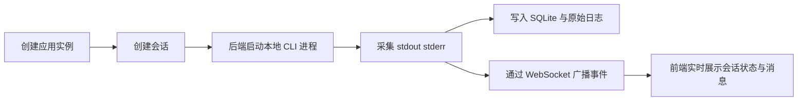

# mutiAgent

<p align="center">
  
</p>


把本地 AI CLI 进程，变成**可管理、可追踪、可回放、可联动前端界面**的会话系统。

`mutiAgent` 是一个面向桌面 AI 控制台场景的后端服务，当前基于 `Spring Boot + SQLite + WebSocket + MyBatis + pty4j` 实现。它的目标不是单纯“启动一个命令”，而是把像 `Codex` 这类 CLI 工具包装成可以被实例管理、会话追踪、消息记录、日志留存和实时推送的运行时系统。

## 这个项目解决什么问题

很多本地 AI CLI 工具都能跑，但很难统一解决下面这些事：

- 怎么保存不同 AI 工具的实例配置
- 怎么追踪每次会话的状态、输入、输出和退出原因
- 怎么把原始终端流实时推给前端页面
- 怎么把原始日志和结构化消息一起沉淀下来
- 怎么让桌面端、Web 前端、后端运行时保持一致的数据视图

`mutiAgent` 当前就是围绕这些问题来搭后端基础设施。

## 一眼看懂它的价值

- **实例管理**：管理不同 AI CLI 应用实例
- **会话编排**：创建、启动、停止、查询会话
- **运行时追踪**：保存运行状态、PID、退出码、原始日志路径
- **消息沉淀**：同时记录结构化消息和原始终端流
- **实时推送**：通过 WebSocket 把会话事件广播给前端
- **本地持久化**：使用 SQLite，零外部数据库依赖

## Demo 路径

下面是一个最典型的使用路径：从“注册一个 CLI 实例”到“启动会话并实时消费输出”。



## 快速开始

### 运行环境

- `JDK 17`
- 建议使用本机 Windows 或标准化 `WSL2` 环境
- 无需额外安装数据库，默认使用本地 `SQLite`

### 启动服务

```powershell
cd D:\Project\ali\260409\mutiAgent
.\gradlew.bat bootRun
```

默认启动地址：

- HTTP：`http://127.0.0.1:18109`
- WebSocket：`ws://127.0.0.1:18109/ws/sessions`

### 启动后先检查

```bash
curl http://127.0.0.1:18109/api/v1/runtime/health
```

如果服务正常，你会看到类似：

```json
{
  "success": true,
  "data": {
    "status": "UP",
    "dbPath": ".../data/muti-agent.db",
    "baseDir": ".../mutiAgent",
    "runningProcesses": 0
  }
}
```

## 5 分钟上手 Demo

### 1. 创建一个应用实例

下面示例注册一个 `Codex CLI` 实例。

```bash
curl -X POST http://127.0.0.1:18109/api/v1/instances \
  -H "Content-Type: application/json" \
  -d '{
    "name": "Codex CLI",
    "appType": "codex",
    "adapterType": "codex-cli",
    "runtimeEnv": "windows",
    "launchMode": "command",
    "launchCommand": "codex",
    "args": [],
    "workdir": "D:\\Project\\ali\\260409",
    "enabled": true,
    "autoRestart": false,
    "remark": "本地 Codex 命令行实例"
  }'
```

### 2. 创建并启动一个会话

把上一步返回的实例 `id` 代入下面请求：

```bash
curl -X POST http://127.0.0.1:18109/api/v1/sessions \
  -H "Content-Type: application/json" \
  -d '{
    "appInstanceId": "ins_xxx",
    "title": "重构 README",
    "projectPath": "D:\\Project\\ali\\260409\\mutiAgent",
    "interactionMode": "raw",
    "initInput": "请先分析这个项目的 README 还能怎么改进",
    "tags": ["demo", "readme"]
  }'
```

### 3. 查看会话列表和消息

```bash
curl http://127.0.0.1:18109/api/v1/sessions
curl http://127.0.0.1:18109/api/v1/sessions/{sessionId}
curl http://127.0.0.1:18109/api/v1/sessions/{sessionId}/messages
```

### 4. 向运行中的会话发送输入

```bash
curl -X POST http://127.0.0.1:18109/api/v1/sessions/{sessionId}/input \
  -H "Content-Type: application/json" \
  -d '{
    "content": "继续，把 README 改成更适合 GitHub 首页展示的版本",
    "appendNewLine": true
  }'
```

### 5. 停止会话

```bash
curl -X POST http://127.0.0.1:18109/api/v1/sessions/{sessionId}/stop \
  -H "Content-Type: application/json" \
  -d '{
    "stopMode": "graceful"
  }'
```

## 当前接口概览

### 运行时

- `GET /api/v1/runtime/health`
- `GET /api/v1/runtime/statistics`
- `GET /api/v1/runtime/processes`

### 应用实例

- `GET /api/v1/instances`
- `GET /api/v1/instances/{id}`
- `POST /api/v1/instances`
- `PUT /api/v1/instances/{id}`
- `POST /api/v1/instances/{id}/enable`
- `POST /api/v1/instances/{id}/disable`

### 会话管理

- `GET /api/v1/sessions`
- `GET /api/v1/sessions/running`
- `GET /api/v1/sessions/{id}`
- `POST /api/v1/sessions`
- `POST /api/v1/sessions/{id}/input`
- `POST /api/v1/sessions/{id}/stop`
- `GET /api/v1/sessions/{id}/messages`

### 实时事件

- WebSocket：`/ws/sessions`

当前 WebSocket 用于广播会话状态变化、错误信息和流式输出事件，适合前端实时刷新会话详情页。

## 数据与日志

服务启动后会自动初始化本地目录和数据库：

- 基础目录：`${LOCALAPPDATA}/mutiAgent` 或 `${user.home}/mutiAgent`
- 数据库：`data/muti-agent.db`
- 会话原始日志：`logs/sessions`
- 应用日志：`logs/app`
- 运行时目录：`runtime`

数据库初始化脚本位于：

- `src/main/resources/db/schema/schema.sql`

当前 schema 已包含：

- `app_instance`
- `session`
- `message`
- `operation_log`
- `config`
- `message_fts`

## 项目结构

```text
src/main/java/com/aliano/mutiagent
├─ application      # 应用服务与 DTO
├─ bootstrap        # 启动期目录与存储准备
├─ common           # 通用模型、异常、工具
├─ config           # Web、WebSocket、数据源、配置项
├─ controller       # REST API 入口
├─ domain           # 实体与枚举
└─ infrastructure   # 适配器、进程管理、事件、持久化
```

## 技术栈

- `Spring Boot 3.5.13`
- `Java 17`
- `MyBatis`
- `SQLite`
- `WebSocket`
- `pty4j`

## 配套前端

如果你想看到更完整的桌面控制台效果，可以搭配前端仓库一起使用：

- 前端项目：`https://github.com/Cure217/mutiAgent-Web`

前端目前承接：

- 总览页
- 应用实例管理
- 会话列表与详情
- WebSocket 实时输出展示
- Electron 桌面容器能力

## 截图建议

当前仓库是后端服务仓库，真正适合放在 GitHub 首页的界面截图，建议来自配套前端 `mutiAgent-Web`。如果后续要继续打磨展示效果，建议至少补这 3 张图：

1. 控制台首页总览
2. 会话详情页与终端输出
3. 应用实例配置页

这样这个仓库和前端仓库会形成非常清晰的“价值 + 路径 + 界面”闭环。

## 文档

更详细的设计文档在 `doc/` 目录：

- `doc/00-文档导航.md`
- `doc/01-项目目录结构设计.md`
- `doc/02-后端模块与包结构设计.md`
- `doc/03-MVP接口清单.md`
- `doc/04-数据库SQL草案.sql`
- `doc/05-初始化脚手架任务清单.md`

## 当前阶段

当前更适合把它理解为：

- 一个已经能跑起来的多 Agent 后端脚手架
- 一个面向本地桌面 AI 控制台的运行时基础设施
- 一个为前端控制台、会话追踪和后续 PTY 终端能力做准备的后端核心

后续如果继续完善，这个项目最值得强化的方向是：

- 更完整的结构化消息解析
- 更细的会话事件模型
- 页内 PTY 交互终端
- 更强的搜索与历史检索能力
